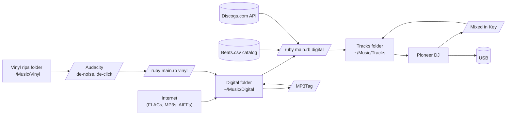

# Tracks

DJ tracks manager

# Prereqs

1. ruby 3.x
1. ffmpeg
1. Set up "DESCRIPTION" as a displayed field in MP3Tag

- This is due to ffmpeg not correctly writing comment tags

# Usage

ruby main.rb [CMD]

to debug, set GLI_DEBUG=true

# Data pipeline

# Workflow (human script)

1. Download beats (Google Sheets) => beats.csv
1. Use Audacity to record vinyl to `~/Music/Vinyl/<serial>/<serial>.aup`
1. De-noise vinyl with AudioLava / RX10 Repair Assistant
1. Label track start positions (1-N)
1. Run File->Export as AIFF to to `~/Music/Vinyl/<serial>/cleaned` (96kHz, 32-bit float)
1. run `ruby main.rb vinyl`
1. Download tracks + albums (flac, aiff, mp3) into `~/Music/Digital`
1. edit tags in MP3Tag
1. run `ruby main.rb digital`
1. have a cup of tea
1. reimport `~/Music/Tracks` in Rekordbox
1. have a cup of tea
1. export music library to `~/Music/rekordbox.xml`
1. open Mixed in Key, analyze tracks
1. in Rekordbox, re-import rekordbox.xml into collection
1. have a cup of tea

# Recording notes

## Vinyl recording settings:

Peak ampitude: -5.04 dB
Total RMS: -22.02 dB
Dynamic range: 44.00 dB
Loudness: -19.02 LUFS

96kHz, 32-bit float aup

## Audio formats

https://cookingtechno.com/cdj-audio-export/

CDJ-850 (2010)
Formats: MP3, AAC, WAV, AIFF
Bit depth: 16 & 24 Bit
Bitrate: 32 Kbps to 320 Kbps
Sample rate, lossy: 32 kHz, 44.1 kHz, 48 kHz
Sample rate, lossless: 44.1 kHz, 48 kHz FAT16, FAT32, HFS+

## Cleanup:

1. High Pass Filter, 24 db/octave roll-off, 20Hz cutoff
1. Split tracks
1. Convert to wav
1. Remove crackles/pops w/AudioLava
1. Amplify to -5.04dB
